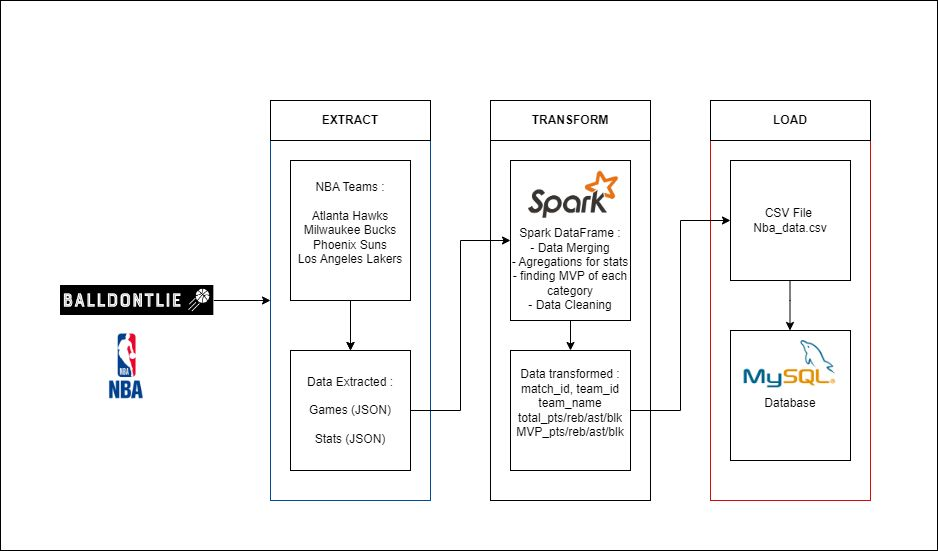
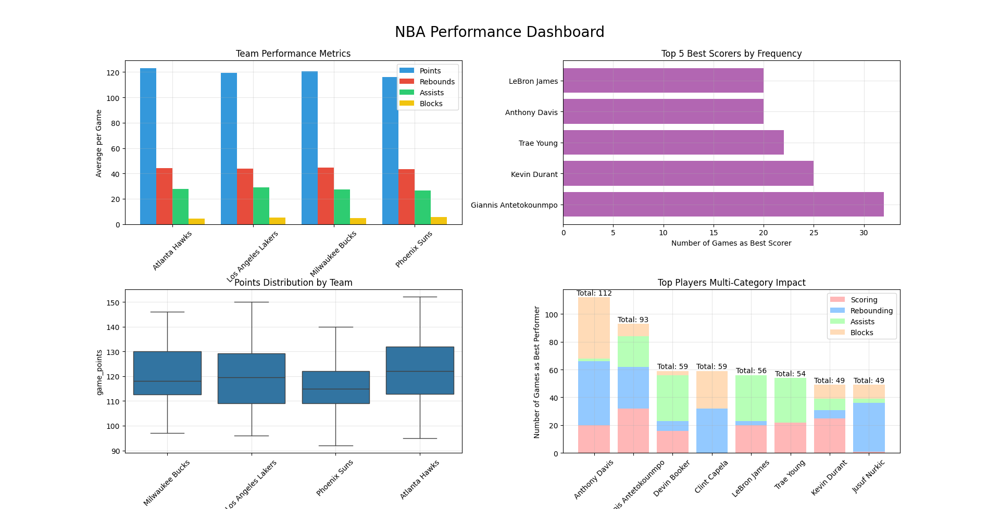

# NBA-ETL
A Scala-based data engineering pipeline that extracts NBA game statistics and player data from the Ball Don't Lie API, transforms it using Apache Spark, and loads it into MySQL database for analysis.

## 🏀 Project Overview

This project implements a complete ETL pipeline that:
- Extracts NBA game data and player statistics via REST API
- Processes data for selected teams (Phoenix Suns, Atlanta Hawks, LA Lakers, Milwaukee Bucks)
- Performs complex transformations using Apache Spark
- Provides both MySQL and CSV output options for analytics

## 🛠️ Technologies Used

- Scala 2.12
- Apache Spark 3.3.1
- MySQL
- balldontlie API
- Libraries:
  - requests
  - ujson
  - os-lib
  - play-json


## 📁 Project Structure

```code
.
├── src/main/scala/
│   ├── Extract.scala   # API data extraction
│   ├── Transform.scala # Data transformation logic
│   ├── Load.scala     # Database loading
│   └── Main.scala     # Pipeline orchestration
├── build.sbt          # Project dependencies
└── README.md
```

## 🛠️ Technical Architecture




## 🔍 Key Features & Implementation Details

### 1. Data Extraction
The pipeline fetches data through paginated API calls with built-in rate limiting:

```scala
def extract_pages_data(url: String, delay: FiniteDuration = 2.seconds): List[ujson.Value] = {
  var cursor: Option[ujson.Value] = None
  var pages_data: List[ujson.Value] = List[ujson.Value]()
  
  do {
    val fullUrl = cursor match {
      case Some(c) => s"$url&cursor=$c"
      case None => url
    }
    
    val ujs: ujson.Value.Value = extract_page(fullUrl)
    // Process data and handle pagination
    Thread.sleep(delay.toMillis)  // Rate limiting
  } while (cursor.isDefined && cursor.get != ujson.Null)
  
  pages_data
}

```

### 2. Data Transformation

Complex transformations using Spark SQL to aggregate team and player statistics:

```scala
def createStatsDataFrame(spark: SparkSession, directory: os.Path): DataFrame = {
  val df = spark.read
    .option("multiline", "true")
    .json((directory / "transformed_*_stats.json").toString)

  // Window functions for player statistics
  val windowSpec = Window.partitionBy("game_id_1", "team_id_1")
  
  val resultDF = filteredDF
    .withColumn("max_pts", max("pts").over(windowSpec))
    .groupBy("game_id_1", "team_id_1", "team_name_1")
    .agg(
      sum("pts").as("total_pts"),
      first(when(col("pts") === col("max_pts"), 
        col("player_name_1")), ignoreNulls = true).as("best_scorer")
      // ... more aggregations
    )
}
```

### 3. Data Loading

Data loading with MySQL integration:
```scala

def loadToMySQL(spark: SparkSession, df: DataFrame, tableName: String): Unit = {
  df.write
    .mode("overwrite")
    .jdbc(url, tableName, connectionProperties)
}
```

## 📊 Data Model

### Input Data Structure
```json
{
  "game": {
    "id": 123,
    "home_team": {"id": 24, "full_name": "Phoenix Suns"},
    "visitor_team": {"id": 14, "full_name": "Los Angeles Lakers"},
    "home_team_score": 105,
    "visitor_team_score": 98
  }
}
```

### Output Schema
```sql
CREATE TABLE nba_data (
  match_id INT,
  team_id INT,
  team_name VARCHAR(100),
  game_points INT,
  total_pts INT,
  total_reb INT,
  total_ast INT,
  total_blk INT,
  best_scorer VARCHAR(100),
  best_rebounder VARCHAR(100),
  best_assist VARCHAR(100),
  best_blocker VARCHAR(100)
);
```

### Quick Start

In order to run the project, here are the steps : 

- Clone the repository :
  
```bash
git clone https://github.com/ezzakibr/nba-data-pipeline.git
```


- Create the MySQL database :

```sql
CREATE DATABASE NBA_INFOS;
CREATE USER 'nba_user'@'localhost' IDENTIFIED BY 'password_nba';
GRANT ALL PRIVILEGES ON NBA_INFOS.* TO 'nba_user'@'localhost';
```
- Update your API key
- Run the program :

```bash
sbt run
```

# Nba Analytics Dashboard




